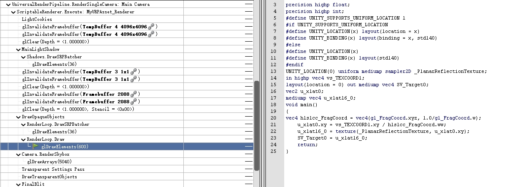

# URP PlanarReflection


## 一、渲染反射贴图

### 1.1 渲染事件

首先，我们需要在相机渲染物体之前渲染反射贴图，以便在后续渲染平面时能用上反射贴图。Unity 提供了一些事件能让我们在 URP 管线执行时插入一些自定义逻辑。

Unity 在每一帧渲染时提供了一些渲染事件。当订阅这些事件时，可以在对应的时机执行自定义逻辑。这些事件在 RenderPipelineManager 类中提供：

- beginContextRendering
- endContextRendering
- beginFrameRendering
- beginCameraRendering
- endFrameRendering
- endCameraRendering

我们使用 beginCameraRendering 事件插入渲染反射贴图的逻辑：

```C#
private void OnEnable()
{
    RenderPipelineManager.beginCameraRendering += ExecutePlanarReflections;
}

// 在 OnDisable、OnDestroy 时关闭并清理
private void Cleanup()
{
    RenderPipelineManager.beginCameraRendering -= ExecutePlanarReflections;
}
```

当场景存在多个相机时，每个相机在渲染前都会触发 beginCameraRendering 事件。所以我们还要过滤掉不参与反射的相机，只处理我们想要的。

```C#
private void ExecutePlanarReflections(ScriptableRenderContext context, Camera camera)
{
    // 不希望在反射和预览相机中进行平面反射
    if (camera.cameraType == CameraType.Reflection || camera.cameraType == CameraType.Preview)
        return;
}
```


### 1.2 反射相机

我们需要一个额外的相机来渲染反射贴图。这个反射相机只用于渲染反射贴图，并且我们希望由我们控制渲染，而不是由 URP 控制。所以这个反射相机会被设置为禁用。

同时我们还可以获取 UniversalAdditionalCameraData 组件，以便我们自定义修改一些相机属性。

```C#
private void UpdateReflectionCamera(Camera realCamera)
{
    if (_reflectionCamera == null)
        _reflectionCamera = CreateMirrorObjects();
}

private Camera CreateMirrorObjects()
{
    var go = new GameObject("Planar Reflections");
    var reflectionCamera = go.AddComponent<Camera>();
    var cameraData = go.AddComponent(typeof(UniversalAdditionalCameraData)) as UniversalAdditionalCameraData;

    // TODO 这里可以对反射相机进行一些设置

    reflectionCamera.depth = -10;
    reflectionCamera.enabled = false;
    go.hideFlags = HideFlags.HideAndDontSave;

    return reflectionCamera;
}
```


平面反射所产生的效果应该与真实渲染的相机一致，所以我们还需要拷贝当前相机的数据到反射相机中，以便确保反射的效果与实际渲染保持一致。

当然有些渲染效果我们不希望应用到反射相机中，比如：阴影。我们可以在这里对反射相机进行调整。

```C#
    private void UpdateCamera(Camera src, Camera dest)
    {
        dest.CopyFrom(src);
        
        // TODO 这里可以改变相机属性
        dest.useOcclusionCulling = false;
        if (dest.gameObject.TryGetComponent(out UniversalAdditionalCameraData camData))
        {
            camData.renderShadows = false; // 关闭反射相机的阴影
        }
    }
```

Camera.CopyFrom 用于拷贝源相机属性到反射相机中。


### 1.3 反射矩阵

反射矩阵是平面反射实现的核心之一。通过 View 矩阵与反射矩阵结合，将反射物体变换到平面下形成倒影的效果。[这里](https://zhuanlan.zhihu.com/p/379857022)描述了反射矩阵的推导原理。

```C#
private void UpdateReflectionCamera(Camera realCamera)
{
    // 省略获取反射相机...

    // 确定反射平面的位置和法线
    Vector3 pos = Vector3.zero;
    Vector3 normal = Vector3.up;
    if (target != null)
    {
        pos = target.transform.position;
        normal = target.transform.up;
    }

    // 创建反射矩阵
    var d = -Vector3.Dot(normal, pos);
    var reflectionPlane = new Vector4(normal.x, normal.y, normal.z, d);

    var reflection = Matrix4x4.identity;
    reflection *= Matrix4x4.Scale(new Vector3(1, -1, 1));

    CalculateReflectionMatrix(ref reflection, reflectionPlane);
}

private static void CalculateReflectionMatrix(ref Matrix4x4 reflectionMat, Vector4 plane)
{
    reflectionMat.m00 = (1F - 2F * plane[0] * plane[0]);
    reflectionMat.m01 = (-2F * plane[0] * plane[1]);
    reflectionMat.m02 = (-2F * plane[0] * plane[2]);
    reflectionMat.m03 = (-2F * plane[3] * plane[0]);

    reflectionMat.m10 = (-2F * plane[1] * plane[0]);
    reflectionMat.m11 = (1F - 2F * plane[1] * plane[1]);
    reflectionMat.m12 = (-2F * plane[1] * plane[2]);
    reflectionMat.m13 = (-2F * plane[3] * plane[1]);

    reflectionMat.m20 = (-2F * plane[2] * plane[0]);
    reflectionMat.m21 = (-2F * plane[2] * plane[1]);
    reflectionMat.m22 = (1F - 2F * plane[2] * plane[2]);
    reflectionMat.m23 = (-2F * plane[3] * plane[2]);

    reflectionMat.m30 = 0F;
    reflectionMat.m31 = 0F;
    reflectionMat.m32 = 0F;
    reflectionMat.m33 = 1F;
}
```

这里每一帧都会重新计算反射矩阵，如果反射平面始终不变，那么反射矩阵应该只需要计算一遍。


拿到反射矩阵后，我们应当应用到相机的 View 矩阵中，将物体变换到正确的地方进行渲染。这里我将反射矩阵应用到了真实相机的 View 矩阵中，而不是使用反射相机的 View 矩阵。这里的好处时，我们不再需要同步反射相机和真实相机的位置，反射相机的具体位置不再重要。

```C#
private void UpdateReflectionCamera(Camera realCamera)
{
    // 省略获取反射相机...

    // 省略获取反射矩阵...
    
    _reflectionCamera.worldToCameraMatrix = realCamera.worldToCameraMatrix * reflection;
}
```

Camera.worldToCameraMatrix 表示了将世界空间变换到当前相机空间的变换矩阵，将其替换为我们的反射矩阵。


### 1.4 投影矩阵

当前反射矩阵还存在一个问题。当物体在反射平面以下，会被变换到反射平面之上，最后导致了不正确的平面反射。为了解决这个问题，我们需要剔除平面之下的物体，它们不应该参与平面反射。


一种简单的方法是修改透视矩阵，将反射平面作为透视矩阵的近平面，这样 Unity 会为我们进行正确的剔除。

```C#
private void UpdateReflectionCamera(Camera realCamera)
{
    // 省略获取反射相机...

    // 省略获取反射矩阵...


    // 投影矩阵
    var clipPlane = CameraSpacePlane(_reflectionCamera, pos - Vector3.up * 0.1f, normal, 1.0f);
    var projection = realCamera.CalculateObliqueMatrix(clipPlane);
    _reflectionCamera.projectionMatrix = projection;
}


```

Camera.CalculateObliqueMatrix 用于计算给定近平面的投影矩阵，我们依然基于真实相机的投影进行计算，最后传递给反射相机。

Camera.CalculateObliqueMatrix 方法的第一个参数是以 Vector4 表示的一个平面，这个平面是基于相机空间的，所以在计算投影矩阵之前，我们需要得到平面在相机空间的表示。

```C#
private Vector4 CameraSpacePlane(Camera cam, Vector3 pos, Vector3 normal, float sideSign)
{
    var m = cam.worldToCameraMatrix;
    var cameraPosition = m.MultiplyPoint(pos);
    var cameraNormal = m.MultiplyVector(normal).normalized * sideSign;
    return new Vector4(cameraNormal.x, cameraNormal.y, cameraNormal.z, -Vector3.Dot(cameraPosition, cameraNormal));
}
```


### 1.5 创建反射贴图

我们已经确定反射相机应该如何渲染了，接下来我们需要确定反射相机应该渲染到哪里。

我们使用 RenderTexture.GetTemporary 方法申请一张临时纹理作为反射相机的渲染纹理。为了性能考虑，我们在申请临时纹理时应该考虑纹理大小、格式以及精度。另一点需要注意的是，手动申请的临时纹理 Unity 不会自己释放，需要执行 RenderTexture.ReleaseTemporary 手动释放。

避免每帧重复申请纹理，我对申请的临时纹理进行了复用。并在反射平面不可用时进行释放。

```C#
private void PlanarReflectionTexture(Camera cam)
{
    if (_reflectionTexture == null)
    {
        // TODO 这里可以做调整 RT 大小
        var x = (int)(cam.pixelWidth * UniversalRenderPipeline.asset.renderScale);
        var y = (int)(cam.pixelHeight * UniversalRenderPipeline.asset.renderScale);

        // 申请 RT
        _reflectionTexture = RenderTexture.GetTemporary(x, y, 16,
                                                        GraphicsFormatUtility.GetGraphicsFormat(RenderTextureFormat.RGB111110Float, true));
    }

    // 将 RT 作为反射相机渲染目标
    _reflectionCamera.targetTexture =  _reflectionTexture;
}
```

RenderTexture.GetTemporary 用于获取临时纹理贴图，对于其传入的参数，以下进行说明：

1. （int）width：纹理像素宽度，-1表示相机像素宽度。
2. （int）height：纹理像素高度，-1表示相机像素高度。
3. （int）depthBuffer：深度缓冲区位数（精度）。
4. （GraphicsFormat）format：渲染纹理的格式。


### 1.6 质量控制

最后，因为平面反射是镜像的，所以我们还需要将 GL.invertCulling 设置为 true。在这里我们还可以随便控制渲染质量设置，以便降低渲染耗时。在反射相机渲染后恢复设置。

```C#
public void Set()
{
    GL.invertCulling = true;
    RenderSettings.fog = false; // disable fog for now as it's incorrect with projection
    QualitySettings.maximumLODLevel = 1;
    QualitySettings.lodBias = _lodBias * 0.5f;
}

public void Restore()
{
    GL.invertCulling = false;
    RenderSettings.fog = _fog;
    QualitySettings.maximumLODLevel = _maxLod;
    QualitySettings.lodBias = _lodBias;
}
```


### 1.7 渲染反射相机

最后通过 UniversalRenderPipeline.RenderSingleCamera 渲染反射相机。

```C#
// 渲染反射相机
UniversalRenderPipeline.RenderSingleCamera(context, _reflectionCamera);
```


## 二、反射贴图采样


### 2.1 接收反射贴图

 在临时纹理创建时，我们还需要将纹理传递到反射材质中。使用 _meshRenderer.sharedMaterial.SetTexture 将反射纹理传递到 Shader 的 _PlanarReflectionTexture 属性中。

```C#
private readonly int _planarReflectionTextureId = Shader.PropertyToID("_PlanarReflectionTexture");

_meshRenderer.sharedMaterial.SetTexture(_planarReflectionTextureId, _reflectionTexture);
```


### 2.2 反射采样

在 Shader 中会接收到反射贴图，我们只需要使用屏幕坐标对其进行采样即可。

```glsl
sampler2D _PlanarReflectionTexture;
float4 _PlanarReflectionTexture_ST;

v2f vert (appdata v)
{
    v2f o;
    o.vertex = UnityObjectToClipPos(v.vertex);
    o.screenPos = ComputeScreenPos(o.vertex);
    //o.uv = TRANSFORM_TEX(v.uv, _MainTex);
    UNITY_TRANSFER_FOG(o,o.vertex);
    return o;
}

fixed4 frag (v2f i) : SV_Target
{
    // sample the texture
    fixed4 col = tex2D(_PlanarReflectionTexture, i.screenPos.xy/i.vertex.w);
    // apply fog
    UNITY_APPLY_FOG(i.fogCoord, col);
    return col;
}
```


## 三、RenderDoc


### 3.1 渲染反射贴图


### 3.2 反射贴图采样




